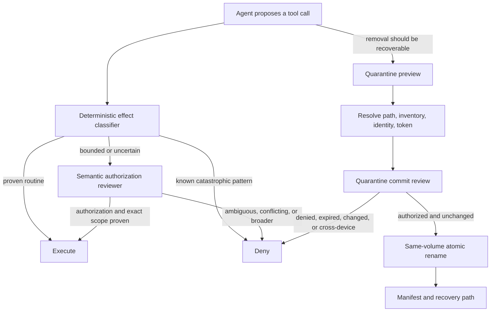

# Architecture

## Safety claim

Auto-Verify narrows the gap between conversational intent and executable effect. It does not attempt to prove that an agent is correct. Its narrower claim is that common catastrophic filesystem operations are either deterministically blocked or transformed into a bounded, reviewable, reversible operation, while routine workspace work remains usable.

## Deterministic classification

`auto-verify-core.mjs` assigns each tool call one of three outcomes:

- `allow`: known read-only operations and exact edits below configured routine writable roots.
- `review`: effects that may be legitimate but require conversational scope reconstruction, including exact deletion, movement, package changes, and unknown tools.
- `block`: known broad or irreversible destructive families, including recursive removal, wildcard deletion, destructive Git cleanup, and purge-style synchronization.

The classifier is intentionally conservative about claims of safety. An unrecognized tool is reviewed rather than silently allowed. Regex classification is not a complete shell parser, so native permission denials remain an independent layer.

## Semantic authorization review

The reviewer receives:

- Visible user and assistant messages as structured `{role, authority, text}` records.
- The exact tool name and sanitized arguments.
- The deterministic classification.
- Resolved effects when the quarantine tool has already bound them.
- Working, writable, protected, and quarantine roots.

User text can authorize. Assistant text can explain what a later “yes” refers to but cannot create permission, including through quoted or embedded role-like markers. Hidden reasoning is never forwarded. A verdict permits execution only when all of these are true:

- `decision` is `allow`.
- `risk_level` is `low` or `medium`.
- `user_authorized` is true.
- `scope_match` is true.
- `protected_conflict` is false.
- `violations` is a valid array of nonempty strings and is empty.

Malformed, unavailable, timed-out, or incomplete reviewer responses fail closed for calls that reached review.

## Transcript compaction

When the visible transcript exceeds the review budget, the selector retains user messages that look like persistent constraints—such as exclusions, keep-lists, “never,” “remember,” and equivalent Italian forms—then fills the remaining budget from the newest conversation entries. This reduces one known failure mode but is heuristic. Critical invariants should also live in the managed `AGENTS.md` policy and deterministic configuration.

## Managed quarantine

Preview performs no mutation. It resolves a single path, rejects wildcards and substitutions, checks allowed and protected boundaries, records a bounded inventory and filesystem identity, and issues a session-bound token with a short expiry.

Commit re-resolves the source, checks the token, session, expiry, and source identity, asks a narrowly configured reviewer to validate user authorization, and then checks identity and inventory again. It verifies that source and quarantine share a filesystem device, creates real non-symlink `items`, container, and payload directories, rechecks destination containment, then uses `rename`. It never falls back to copy-and-delete. A separate manifest records the original path and reviewer result.

The repeated identity and inventory checks reduce time-of-check/time-of-use risk but are not a cryptographic snapshot of every byte below a directory. A narrow race between the final check and `rename` remains a documented platform-level residual risk.

## Installation boundary

The installer modifies only three targets inside the chosen OpenCode configuration directory:

- `plugins/auto-verify-guardian.js`
- `plugins/auto-verify-core.mjs`
- `plugins/quarantine-fs.mjs`
- The marker-bounded block in `AGENTS.md`

Existing targets receive timestamped backups. The installer does not rewrite the user's main JSONC configuration because safely merging arbitrary comments, ordering, and local rules requires user judgment. The uninstaller is recoverable and never deletes quarantine data.
